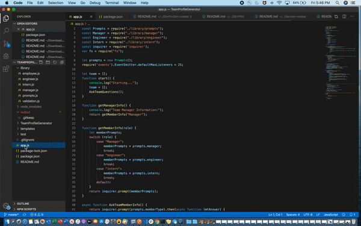

# Team Profile Generator
Command line software team profile generator

​
#### By Lisa Walter
​
## Description
Command line software  team profile generator. The application will ask the user for information about the team, and then create an html page displaying the team and information about the team. Any number of team members can be entered, and team members can be either engineers or interns.

## Features
​
* Produces an html document for an engineering team consists of a manager, and any number of engineers and interns.
​
​
## Setup/Installation Requirements
​
* Clone this repository.
* run command: npm install
* run command: node app.js
​

​

​
## Technologies Used
​
Node.js

## Demo

